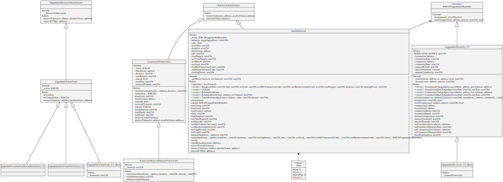

# Diversify

[](https://github.com/Diversify-io/diversify-core/actions/workflows/lint.yml) [](https://github.com/Diversify-io/diversify-core/actions/workflows/tests.yml) [](https://github.com/Diversify-io/diversify-core/actions/workflows/codecov.yml) [](https://codecov.io/gh/Diversify-io/diversify-core) 


Smart contracts implemented in Solidity for Diversify.

## Introduction

The Diversify Token (DIV) is an ERC20 token on the Ethereum Blockchain. It has a deflationary, democratic and diversified character.

The total issuance of the token is 1,000,000,000 DIV. With its diversified underlying asset, the token price is backed and a deflationary structure is implemented by an 1% burning rate with every transaction. The burning stops as soon as a total of 100 000 000 DIV tokens is reached.
Additionally, 0.25% of every transaction are sent to the Diversify Foundation Wallet. These funds will be used to invest in shares of renewable energy companies and charity. The foundation rate of 0.25% is part of the upgradable contract, which stands for the convertibility of the contract after the initial deployment. A minimum and maximum for this rate is irreversibly defined between 0% to 2.5%. This enables the Diversify community to have a vote about how high this rate should be. There are three token offerings – a Seed Sale, a Strategic Sale and a Global Sale.

## Architecture

The following uml provides a high level overview on the contracts.



## Prerequisite

A recent version of [Node.js](https://nodejs.org/) and [Yarn](https://yarnpkg.com/) are required to compile the contracts and run tests.

### ENV

- `INFURA_API_KEY`
- `ETHERSCAN_API_KEY`
- `COIN_MARKET_CAPI_KEY`

## Compiling

Build the smart contracts using [Hardhat](https://hardhat.org/) with the following command:

```sh
$ yarn install
$ yarn compile
```

You can find compiled contracts in the `./artifacts` folder upon successful compilation.

## Testing

Run test cases with [Hardhat](https://hardhat.org/):

```sh
$ yarn test
```

## Deployment

### HardHat

```sh
npx hardhat node
```

### Mainnet

```sh
yarn mainnet:deploy
```

```sh
yarn mainnet:verify
```

```sh
hardhat tenderly:verify --network mainnet ContractName=Address
```

```sh
hardhat tenderly:push --network mainnet ContractName=Address
```

### Rinkeby

```sh
yarn rinkeby:deploy
```

```sh
yarn rinkeby:verify
```

```sh
hardhat tenderly:verify --network rinkeby ContractName=Address
```

## Community

[](https://twitter.com/diversify_io) [](https://t.me/diversify_offical)

## License

All code in this repository is licensed under [MIT](./LICENSE).
